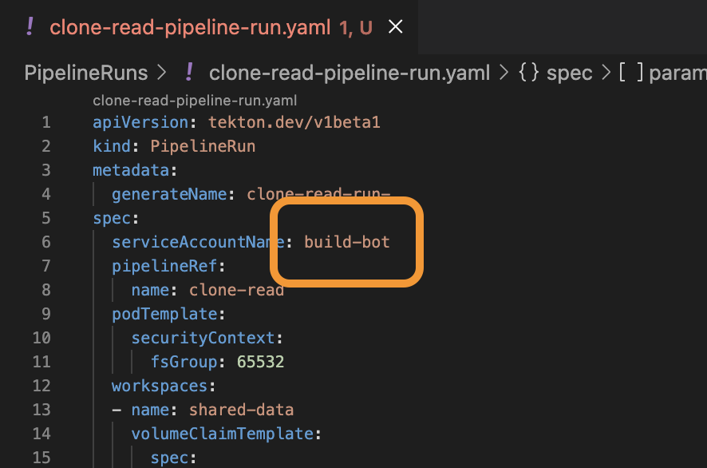
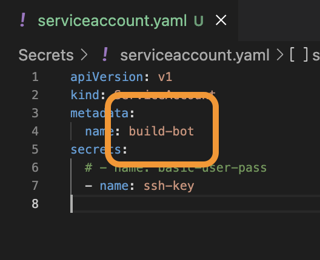
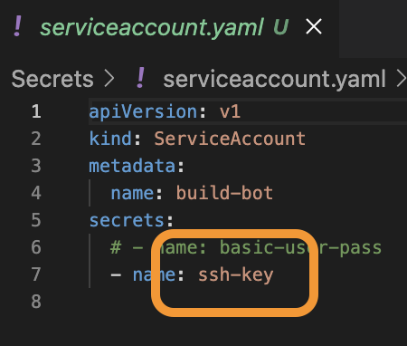

# GitHub authentication

Any `Task` in this project will utilize a `Secret` to authenticate with GitHub via either:
- GitHub user's **SSH key**, or
- GitHub user's **personal access token (PAT)**

For instance, the `clone-read` pipeline (defined in `Pipelines/clone-read-pipeline.yaml`) runs the `fetch-source` task. This task provides an interface to authenticate with `git` before cloning source code from a GitHub repository.

Notice the `PipelineRun` that runs the `clone-read` pipeline (`PipelineRuns/clone-read-pipeline-run.yaml`) indicates `build-bot` for its `spec.serviceAccountName`.



`build-bot` is the `metadata.name` of the `ServiceAccount` (`Secrets/serviceaccount.yaml`) associated with one of the two `Secret`s used for Git / GitHub authentication:
- `Secrets/ssh_secret.yaml`
- `Secrets/basic_auth_secret.yaml`



In `Secrets/serviceaccount.yaml`, the `secrets[0].name` specifies `ssh-key`, meaning that this `ServiceAccount` configuration will authenticate with Git / GitHub via the user's SSH key.




---


### Generate a new GitHub user account SSH key

<details>
<summary>Expand</summary>

```shell
cd ~/.ssh
```

```shell
ssh-keygen -t ed25519 -C "your_email@example.com"
```

> If you are using a legacy system that doesn't support the Ed25519 algorithm, use:

```shell
ssh-keygen -t rsa -b 4096 -C "your_email@example.com"
``` 

</details>


---


### Add your SSH key to the SSH agent

See also: <a href="https://docs.github.com/en/authentication/connecting-to-github-with-ssh/generating-a-new-ssh-key-and-adding-it-to-the-ssh-agent#adding-your-ssh-key-to-the-ssh-agent">Adding your SSH key to the SSH agent</a>

<details>
<summary>Expand</summary>

```shell
eval "$(ssh-agent -s)"
```

**Output**

```
> Agent pid 59566
```

Create a `config` file at `~/.ssh`:

```shell
touch ~/.ssh/config
```

Open your `~/.ssh/config` file, then modify the file to contain the following lines. If your SSH key file has a different name or path than the example code, modify the filename or path to match your current setup.

```shell
Host HOSTNAME
  AddKeysToAgent yes
  UseKeychain yes
  IdentityFile ~/.ssh/id_ed25519
```

Add your SSH private key to the `ssh-agent` and store your passphrase in the keychain.

If you created your key with a different name, or if you are adding an existing key that has a different name, replace `id_ed25519` in the command with the name of your private key file.

```shell
ssh-add --apple-use-keychain ~/.ssh/id_ed25519
```

</details>


---


### Generate the `ssh_secret.yaml` file

<details>
<summary>Expand</summary>

Run the script:

`scripts/generate_ssh_secret.sh`

```shell
#!/bin/bash

GH_SSH_TOKEN="$(cat ~/.ssh/${PRIVATE_KEY_FILENAME})"

cat <<EOF > ./Secrets/ssh_secret.yaml
apiVersion: v1
kind: Secret
metadata:
  annotations:
    tekton.dev/git-0: https://github.com
type: kubernetes.io/ssh-auth
stringData:
  ssh-privatekey: ${GH_SSH_TOKEN}
  known-hosts: ${GH_SSH_TOKEN}
EOF
```

This generates a file: `Secrets/ssh_secret.yaml`

This file is referenced by the `ServiceAccount` (`Secrets/serviceaccount.yaml`) and will be used to authenticate with Git / GitHub.

</details>
