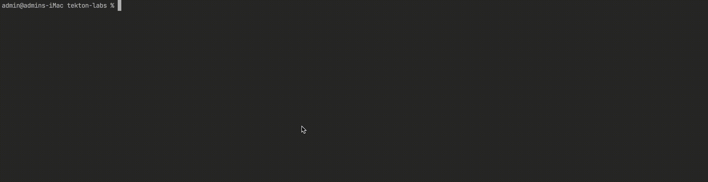
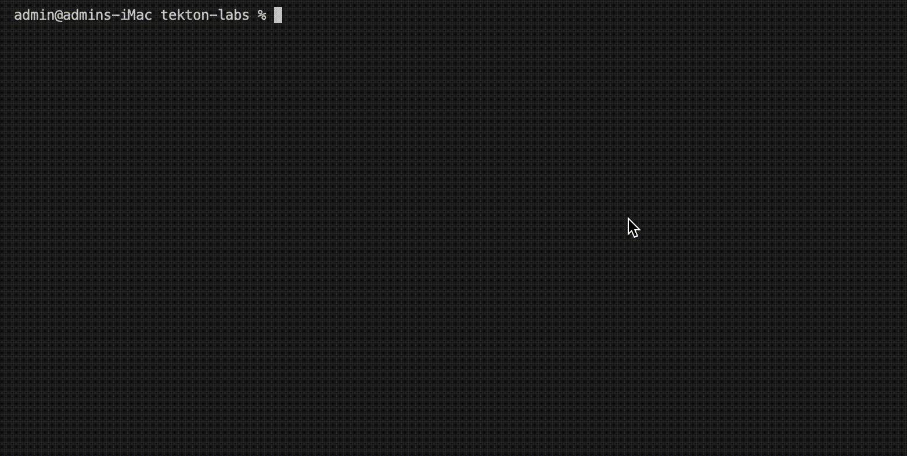

# Installation and setup

### **1**: `minikube` installation

<details>
<summary>Expand</summary>

```shell
brew install minikube
```

For other installation options, refer to: https://minikube.sigs.k8s.io/docs/start/

</details>


### **2**: Install the Tekton CLI to your machine

<details>
<summary>Expand</summary>

```shell
brew install tektoncd-cli
```

More info: https://tekton.dev/docs/cli/#installation

</details>


### **3**: (Optional) Mount directories from local system

<details>
<summary>Expand</summary>

```shell
# minikube mount /path/on/local/system:/source
minikube start --kubernetes-version v1.24.4 --mount-string="/path/on/local/system:/source" --mount
```

</details>


### **4**: Create a cluster

<details>
<summary>Expand</summary>

```shell
minikube start --kubernetes-version v1.24.4
#minikube start --driver qemu --network socket_vmnet
```

<!--  -->

</details>


### **5**: Check that the cluster was successfully created using `kubectl`

<details>
<summary>Expand</summary>

```shell
kubectl cluster-info
```

<!--  -->

</details>


### **6**: Install Tekton pipelines

<details>
<summary>Expand</summary>

1. Install the latest version of Tekton pipelines

     ```shell
     kubectl apply --filename \
       https://storage.googleapis.com/tekton-releases/pipeline/latest/release.yaml
     ```

     <!--  -->

2. Monitor the installation

     ```shell
     kubectl get pods --namespace tekton-pipelines --watch
     ```

     <!--  -->

     When both `tekton-pipelines-controller` and `tekton-pipelines-webhook` show `1/1` under the `READY` column, you are ready to continue. For example:

     ```shell
     NAME                                           READY    STATUS               RESTARTS     AGE
     tekton-pipelines-controller-6d989cc968-j57cs   0/1      Pending              0            3s
     tekton-pipelines-webhook-69744499d9-t58s5      0/1      ContainerCreating    0            3s
     tekton-pipelines-controller-6d989cc968-j57cs   0/1      ContainerCreating    0            3s
     tekton-pipelines-controller-6d989cc968-j57cs   0/1      Running              0            5s
     tekton-pipelines-webhook-69744499d9-t58s5      0/1      Running              0            6s
     tekton-pipelines-controller-6d989cc968-j57cs   1/1      Running              0            10s
     tekton-pipelines-webhook-69744499d9-t58s5      1/1      Running              0            20s
     ```

  Hit _Ctrl + C_ to stop monitoring.

</details>
