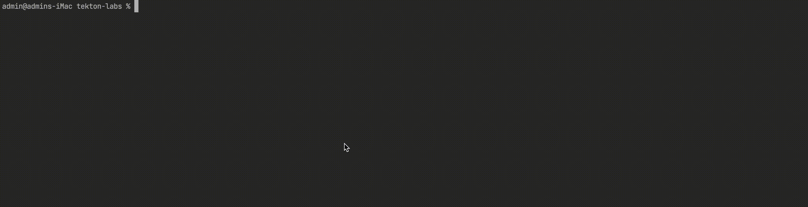

# Using Tekton with `minikube`: Basics

Refer to:
- <a href="https://minikube.sigs.k8s.io/docs/start/">minikube: Getting started</a>
- <a href="https://tekton.dev/docs/getting-started/tasks">Tutorial: Getting started with Tasks</a>


This `README` show you how to:
- Create a Kubernetes cluster with <a href="https://minikube.sigs.k8s.io/docs">minikube</a>
- Install Tekton pipelines
- Create and run a basic `Task`
- Cleanup


---


## Shell scripts

### 1. Create a cluster

```shell
minikube start --kubernetes-version v1.24.4
```




### 2. Check that the cluster was successfully created using `kubectl`

```shell
kubectl cluster-info
```

<!--  -->


### 3. Install Tekton pipelines

1. Install the latest version of Tekton pipelines

    ```shell
    kubectl apply --filename \
      https://storage.googleapis.com/tekton-releases/pipeline/latest/release.yaml
    ```

    <!--  -->

2. Monitor the installation:

    ```shell
    kubectl get pods --namespace tekton-pipelines --watch
    ```

    

    When both `tekton-pipelines-controller` and `tekton-pipelines-webhook` show `1/1` under the `READY` column, you are ready to continue. For example:

    ```shell
    NAME                                           READY    STATUS               RESTARTS     AGE
    tekton-pipelines-controller-6d989cc968-j57cs   0/1      Pending              0            3s
    tekton-pipelines-webhook-69744499d9-t58s5      0/1      ContainerCreating    0            3s
    tekton-pipelines-controller-6d989cc968-j57cs   0/1      ContainerCreating    0            3s
    tekton-pipelines-controller-6d989cc968-j57cs   0/1      Running              0            5s
    tekton-pipelines-webhook-69744499d9-t58s5      0/1      Running              0            6s
    tekton-pipelines-controller-6d989cc968-j57cs   1/1      Running              0            10s
    tekton-pipelines-webhook-69744499d9-t58s5      1/1      Running              0            20s
    ```

  Hit _Ctrl + C_ to stop monitoring.


---


## Create and run a basic `Task`

A `Task`, represented in the API as an object of kind `Task`, defines a series of `Steps` that run sequentially to perform logic that the `Task` requires.

Every `Task` runs as a pod on the Kubernetes cluster, with each step running in its own container.

1. To create a `Task`, open your favorite editor and create a file named `hello.yaml` with the following contents:

    ```yaml
    apiVersion: tekton.dev/v1beta1
    kind: Task
    metadata:
      name: hello
    spec:
      steps:
        - name: echo
          image: alpine
          script: |
            #!/bin/sh
            echo "Hello"
    ```

2. Apply the changes to your cluster:

    ```shell
    kubectl apply --filename Tasks/hello.yaml
    ```

    The output confirms that the `Task` was completed successfully.

    ```shell
    task.tekton.dev/hello created
    ```

3. A `TaskRun` object instantiates and executes this `Task`. Create another file named `hello-task-run.yaml` with the following content:

    ```yaml
    apiVersion: tekton.dev/v1beta1
    kind: TaskRun
    metadata:
      name: hello-task-run
    spec:
      serviceAccountName: ''
      taskRef:
        name: hello
    ```

4. Apply the changes to your cluster to launch the `Task`:

   ```shell
   kubectl apply --filename TaskRuns/hello-task-run.yaml
   ```

5. Verify that everything worked correctly:

   ```shell
   kubectl get taskrun hello-task-run
   ```

6. Take a look at the logs:

   ```shell
   kubectl logs --selector=tekton.dev/taskRun=hello-task-run
   ```

   The output displays the message:

   ```
   Hello
   ```

## Cleanup

To delete the cluster that you created for this guide, run:

```shell
minikube delete
```
